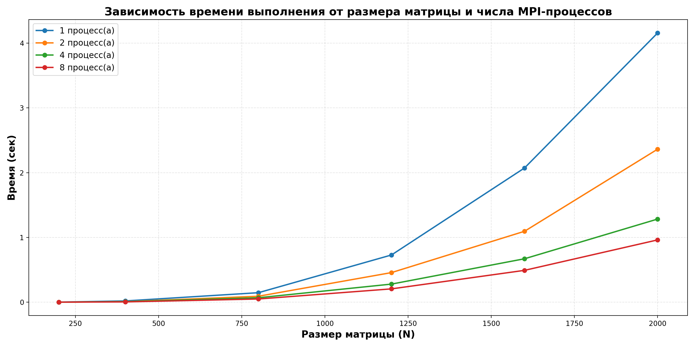

# Лабораторная работа №3
## Умножение квадратных матриц с использованием MPI

---

## Задание

Модифицировать программу из лабораторной работы №1 для параллельной работы по технологии MPI. Провести серию экспериментов:

- с разными размерами матриц: `200, 400, 800, 1200, 1600, 2000`;
- с разным количеством процессов: `1, 2, 4, 8`.

---

## Реализация

За основу взята программа из лабораторной работы №1. Параллелизация выполнена средствами MPI:

- процесс `0` читает исходные матрицы `first_N.txt` и `second_N.txt` из папки `matrix/`;
- матрица `B` рассылается всем процессам через `MPI_Bcast`;
- строки матрицы `A` распределяются между процессами через `MPI_Scatterv`;
- каждый процесс считает свой блок строк результирующей матрицы `C`;
- результат собирается на процессе `0` через `MPI_Gatherv` и записывается в `result/result_N.txt`;
- замер времени — между `MPI_Barrier` через `MPI_Wtime`.

Ключевые MPI-вызовы:

```cpp
MPI_Bcast(BFlat.data(), n * n, MPI_DOUBLE, 0, MPI_COMM_WORLD);
MPI_Scatterv(AFlat.data(), counts.data(), displs.data(), MPI_DOUBLE,
             localA.data(), localCount, MPI_DOUBLE, 0, MPI_COMM_WORLD);
MPI_Gatherv(localC.data(), localCount, MPI_DOUBLE,
            CFlat.data(), counts.data(), displs.data(), MPI_DOUBLE,
            0, MPI_COMM_WORLD);
```

---

## Запуск

### Требования

- MS-MPI Runtime (`mpiexec.exe`) и MS-MPI SDK (`mpi.h`, `msmpi.lib`)
- Visual Studio 2022 (Community / Build Tools) с C++ workload
- Python 3.x + `numpy`, `matplotlib`

### Полный запуск одной кнопкой

Двойной клик на `run_all.bat`. Скрипт:

1. проверяет MS-MPI Runtime, MS-MPI SDK и MSVC, при отсутствии ставит их через `winget`;
2. генерирует входные матрицы (`generate_all_matrices.py`);
3. компилирует `main.cpp` через `cl` с подключением MS-MPI;
4. запускает `mpiexec -n N main.exe` для `N = 1, 2, 4, 8`;
5. проверяет результаты через `verify.py`;
6. строит график (`plot_results.py`).

### Ручной запуск

```bat
python generate_all_matrices.py

REM Сборка (через Developer Command Prompt for VS 2022)
cl /O2 /EHsc /std:c++17 /I "C:\Program Files (x86)\Microsoft SDKs\MPI\Include" main.cpp /Fe:main.exe /link /LIBPATH:"C:\Program Files (x86)\Microsoft SDKs\MPI\Lib\x64" msmpi.lib

REM Запуск
for %%P in (1 2 4 8) do "C:\Program Files\Microsoft MPI\Bin\mpiexec.exe" -n %%P main.exe

python verify.py
python plot_results.py
```

---

## Результаты

После прогона `run_all.bat` числовые результаты появятся в `result/statistics_mpi.txt`, график — в `result/time_plot.png`.



---

## Структура проекта

```
lab_3/
├── main.cpp                     — MPI-программа (умножение матриц)
├── generate_all_matrices.py     — генератор входных матриц (numpy)
├── verify.py                    — верификация (numpy)
├── plot_results.py              — построение графика (matplotlib)
├── run_all.bat                  — авто-установка + сборка + запуск + проверка
├── README.md                    — этот отчёт
├── matrix/
│   ├── first_N.txt              — входная матрица A
│   └── second_N.txt             — входная матрица B
└── result/
    ├── result_N.txt             — результирующие матрицы
    ├── statistics_mpi.txt       — статистика по запускам
    └── time_plot.png            — график
```

---

## Выводы

1. Программа из лабораторной работы №1 модифицирована для параллельной работы средствами MPI. Матрица `A` распределяется по строкам, матрица `B` рассылается целиком, результирующая матрица `C` собирается на процессе `0`.

2. Для больших матриц MPI-версия значительно ускоряет вычисления по сравнению с однопроцессным запуском.

3. Для маленьких матриц увеличение числа процессов не даёт существенного выигрыша — накладные расходы на обмен данными и синхронизацию сопоставимы с временем вычислений.

4. Результаты верифицированы через `numpy` — все тесты пройдены.
