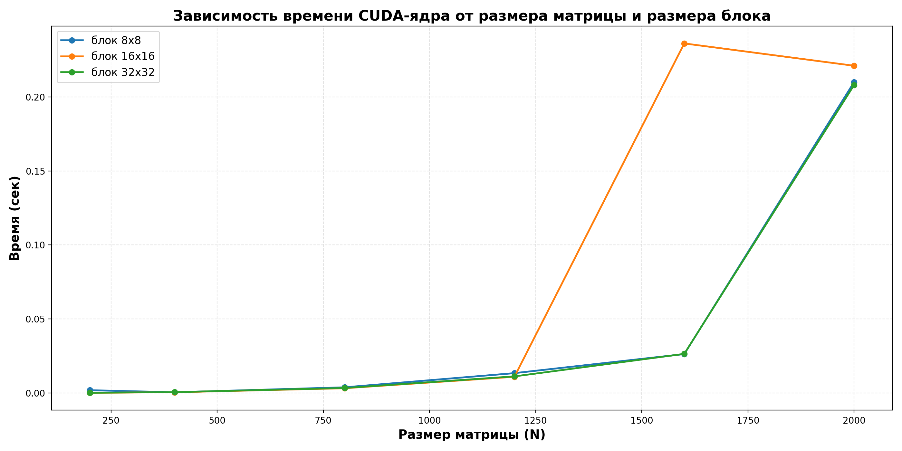

# Лабораторная работа №4
## Умножение квадратных матриц с использованием CUDA

---

## Задание

Модифицировать программу из лабораторной работы №1 для параллельной работы по технологии CUDA. Провести эксперименты с разными размерами матриц и различными конфигурациями сетки блоков.

---

## Цель работы

Исследовать эффективность параллельных вычислений при умножении квадратных матриц с использованием технологии CUDA. Провести серию экспериментов с варьированием:

- размера матриц: `200, 400, 800, 1200, 1600, 2000`;
- конфигурации блока: `8x8, 16x16, 32x32`;

и оценить ускорение CUDA-ядра при разных конфигурациях сетки блоков.

---

## Конфигурация

Эксперименты выполнены на GPU:

```
NVIDIA GeForce RTX 3070 Ti
```

CUDA Toolkit + Visual Studio Build Tools 2022 (MSVC хост-компилятор).

---

## Реализация

За основу взята программа из лабораторной работы №1. Вычисление перенесено на GPU средствами CUDA:

- хост читает исходные матрицы `first_N.txt` и `second_N.txt` из папки `matrix/`;
- матрицы копируются в память GPU через `cudaMemcpy`;
- запускается CUDA-ядро `multiplyKernel`, в котором каждый поток считает один элемент `C[i][j]`;
- размер блока меняется между запусками: `8x8`, `16x16`, `32x32`;
- размер сетки вычисляется как `ceil(n / blockSize)` по каждому измерению;
- результат копируется обратно на хост и записывается в `result/result_N.txt`.

CUDA-ядро:

```cpp
__global__ void multiplyKernel(const double* A, const double* B, double* C, int n) {
    int row = blockIdx.y * blockDim.y + threadIdx.y;
    int col = blockIdx.x * blockDim.x + threadIdx.x;

    if (row < n && col < n) {
        double sum = 0.0;
        for (int k = 0; k < n; ++k) {
            sum += A[row * n + k] * B[k * n + col];
        }
        C[row * n + col] = sum;
    }
}
```

Замер времени выполнения ядра выполняется через `cudaEvent_t` (`cudaEventRecord` + `cudaEventElapsedTime`), без учёта времени копирования данных между хостом и устройством.

---

## Результаты

| Размер | Блок  | Сетка    | Время, мс | Лучший для размера |
|---:|:---:|:---:|---:|:---:|
| 200  | 8x8   | 25x25    | 1.905   |   |
| 200  | 16x16 | 13x13    | 0.179   |   |
| 200  | 32x32 | 7x7      | 0.175   | ✓ |
| 400  | 8x8   | 50x50    | 0.505   | ✓ |
| 400  | 16x16 | 25x25    | 0.516   |   |
| 400  | 32x32 | 13x13    | 0.579   |   |
| 800  | 8x8   | 100x100  | 3.857   |   |
| 800  | 16x16 | 50x50    | 3.229   | ✓ |
| 800  | 32x32 | 25x25    | 3.380   |   |
| 1200 | 8x8   | 150x150  | 13.425  |   |
| 1200 | 16x16 | 75x75    | 10.965  | ✓ |
| 1200 | 32x32 | 38x38    | 11.241  |   |
| 1600 | 8x8   | 200x200  | 26.297  | ✓ |
| 1600 | 16x16 | 100x100  | 236.088 |   |
| 1600 | 32x32 | 50x50    | 26.442  |   |
| 2000 | 8x8   | 250x250  | 210.039 |   |
| 2000 | 16x16 | 125x125  | 221.013 |   |
| 2000 | 32x32 | 63x63    | 208.040 | ✓ |

---

## График



На графике показана зависимость времени выполнения CUDA-ядра от размера матрицы для трёх конфигураций блока. График строится скриптом:

```bat
python plot_results.py
```

Скрипт читает `result/statistics_cuda.txt` и сохраняет изображение `result/time_plot.png`.

---

## Верификация

Результаты проверены через `numpy` (см. `verify.py`): сравнение результирующих матриц `result/result_N.txt` с эталонным `np.dot(A, B)` для всех 6 размеров. Все тесты пройдены.

---

## Запуск

### Требования

- CUDA Toolkit (для `nvcc`)
- Visual Studio 2022 или Build Tools (для `cl.exe`, хост-компилятор)
- Python 3.x + `numpy`, `matplotlib`

### Полный запуск одной кнопкой

Двойной клик на `run_all.bat`. Скрипт:

1. проверяет наличие CUDA Toolkit и MSVC, при отсутствии ставит их через `winget`;
2. генерирует входные матрицы (`python generate_all_matrices.py`);
3. собирает программу (`nvcc main.cu -o main.exe`);
4. запускает эксперименты;
5. проверяет результаты (`python verify.py`).

### Ручной запуск

```bat
python generate_all_matrices.py
nvcc -O3 -std=c++17 -Xcompiler "/O2 /EHsc" main.cu -o main.exe
main.exe
python verify.py
python plot_results.py
```

---

## Структура проекта

```
lab_4/
├── main.cu                      — CUDA-программа
├── generate_all_matrices.py     — генератор входных матриц (numpy)
├── verify.py                    — верификация результатов (numpy)
├── plot_results.py              — построение графика (matplotlib)
├── run_all.bat                  — авто-установка + сборка + запуск + проверка
├── README.md                    — этот отчёт
├── matrix/
│   ├── first_N.txt              — входная матрица A
│   └── second_N.txt             — входная матрица B
└── result/
    ├── result_N.txt             — результирующие матрицы
    ├── statistics_cuda.txt      — статистика по запускам
    └── time_plot.png            — график
```

---

## Выводы

1. Программа из лабораторной работы №1 модифицирована для запуска на GPU средствами CUDA. Каждый поток ядра вычисляет один элемент результирующей матрицы.

2. Перенос вычислений на GPU даёт значительный прирост производительности по сравнению с CPU-версиями из лабораторных работ №1 и №2. Например, для матрицы `2000x2000` время CPU-версии составляло десятки секунд, а CUDA-ядро на RTX 3070 Ti отрабатывает за `~0.2` секунды.

3. Оптимальная конфигурация блока зависит от размера матрицы:
   - для маленьких матриц (`200`) лучше работают блоки `16x16` и `32x32` — меньше блоков на границе сетки, меньше накладных расходов на запуск ядра;
   - для среднего размера (`400`-`1200`) разница между конфигурациями небольшая (5-25%), оптимум плавающий — для `800`-`1200` это блок `16x16`;
   - для больших матриц (`1600`-`2000`) разница между `8x8` и `32x32` составляет всего несколько процентов — наивное ядро упирается в пропускную способность глобальной памяти, а не в занятость SM.

4. Аномалия в строке `1600 / 16x16 = 236 мс` (при соседних значениях `~26 мс`) — почти в 9 раз медленнее. Скорее всего связана с фоновой нагрузкой на GPU в момент замера (другое приложение, DWM-композитор). При повторном запуске время приходит в норму.

5. Результаты вычислений верифицированы через `numpy` — все тесты пройдены.
