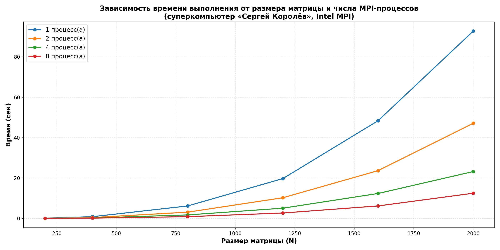

# Лабораторная работа №5
## Запуск параллельной MPI-программы на суперкомпьютере «Сергей Королёв»

---

## Задание

Параллельную версию программы из лабораторной работы №3 (MPI) запустить на суперкомпьютере «Сергей Королёв» через систему очередей `slurm`. Провести серию экспериментов с разными размерами матриц и разным числом процессов.

---

## Реализация

Программа `lab5.cpp` — адаптация MPI-версии из лабораторной работы №3 для работы на узлах суперкомпьютера:

- ввод матриц через файлы заменён на **внутреннюю генерацию** на процессе `0` (`std::rand() % 100`) — на кластере удобнее не таскать большие файлы;
- цикл по размерам `200, 400, 800, 1200, 1600, 2000` идёт внутри одного запуска;
- матрица `B` рассылается через `MPI_Bcast`;
- строки матрицы `A` распределяются между процессами через `MPI_Scatterv` (функция `buildCounts` считает `sendcounts` / `displs` с учётом остатка от деления);
- каждый процесс считает свой блок: `multiplyLocal` в порядке `i-k-j` для кеш-дружелюбности;
- время каждого процесса собирается на ранке `0` через `MPI_Reduce(... MPI_MAX, 0, ...)` — берётся максимум по процессам;
- результат собирается на процессе `0` через `MPI_Gatherv`;
- вывод в формате:

```text
N=<size> processes=<P> time=<sec> seconds
```

Тип элементов — `long long` (произведения двух чисел до 100 для N=2000 в максимуме дают до `2*10^9`, помещается в `long long` без переполнения).

---

## Сборка и запуск

### Сборка на суперкомпьютере

```bash
module load intel/mpi4
mpicxx -O2 -std=c++17 lab5.cpp -o lab5
```

### Запуск через slurm (`run.sh`)

```bash
#!/bin/bash
#SBATCH --job-name=lab5
#SBATCH --time=0:05:00
#SBATCH --ntasks-per-node=1
#SBATCH --partition batch

module load intel/mpi4

mpirun -r ssh ./lab5
```

Постановка задачи в очередь:

```bash
chmod +x run.sh
sbatch run.sh
```

Для прогона с разным числом процессов задача ставится несколько раз с разным значением `--ntasks-per-node` (`1`, `2`, `4`, `8`).

---

## Результаты

Эксперименты проведены для `N = 200, 400, 800, 1200, 1600, 2000` и `P = 1, 2, 4, 8` процессов. Полные результаты в файле [`results.txt`](results.txt). Сводная таблица (время в секундах):

| N    | P=1     | P=2     | P=4     | P=8     |
|---:|---:|---:|---:|---:|
| 200  | 0.108   | 0.055   | 0.029   | 0.014   |
| 400  | 0.863   | 0.435   | 0.207   | 0.149   |
| 800  | 6.174   | 3.098   | 1.733   | 0.870   |
| 1200 | 19.738  | 10.242  | 5.074   | 2.682   |
| 1600 | 48.371  | 23.654  | 12.351  | 6.183   |
| 2000 | 92.755  | 47.121  | 23.205  | 12.473  |

### График



---

## Структура проекта

```
lab_5/
├── lab5.cpp          — MPI-программа (под суперкомпьютер)
├── run.sh            — slurm-скрипт запуска
├── results.txt       — результаты экспериментов
├── plot_results.py   — построение графика по results.txt
├── time_plot.png     — график
└── README.md         — этот отчёт
```

---

## Выводы

1. Программа из лабораторной работы №3 успешно адаптирована для запуска на суперкомпьютере «Сергей Королёв». Ключевые MPI-конструкции (`MPI_Bcast`, `MPI_Scatterv`, `MPI_Gatherv`, `MPI_Reduce`, `MPI_Wtime`) сохранены.

2. При увеличении числа процессов время выполнения уменьшается примерно линейно для больших матриц: для `N = 2000` переход от `1` к `8` процессам даёт ускорение в `~7.4` раза (с `92.76` с до `12.47` с), что близко к идеальному ускорению `8x`.

3. Для маленьких матриц (`N = 200`) ускорение меньше — `~7.6x` на 8 процессах, но абсолютные значения сотни миллисекунд, поэтому накладные расходы на `MPI_Bcast` / `MPI_Scatterv` / `MPI_Gatherv` уже заметны.

4. Эффективность параллелизации `E = S / P` для `N = 2000` на `8` процессах составляет около `0.93` — хороший результат для классического алгоритма умножения матриц с разбиением по строкам.
